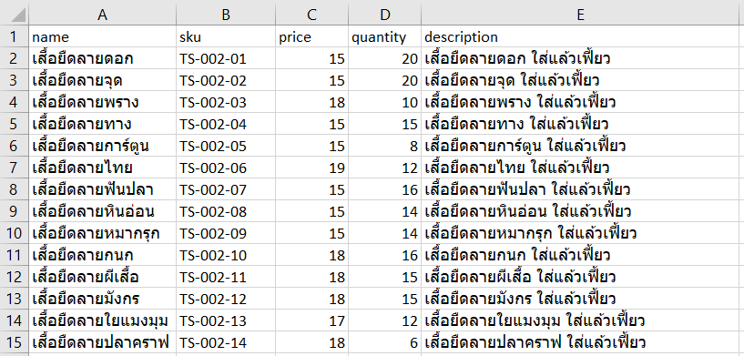

เคยต้องมานั่งกรอกฟอร์มบนเว็บซ้ำ ๆ ทั้งที่มีไฟล์ CSV หรือ Excel อยู่แล้วไหมครับ แล้วเว็บที่เรากรอกก็ดันไม่มีปุ่มให้นำเข้าข้อมูลจากไฟล์ที่มีอยู่แล้วอีก ทำให้ต้องมานั่งพิมพ์เองทีละรายการเป็นสิบรอบร้อยรอบ แทนที่จะได้เอาเวลาไป~~แอบงีบ~~ทำอย่างอื่นที่มีประโยชน์กว่า บทความนี้เลยจะมาแนะนำวิธีเขียนโปรแกรมช่วยกรอกฟอร์มบนเว็บจากข้อมูลในไฟล์ Excel โดยใช้ภาษา Python และไรบรารี Playwright ครับ



กลุ่มเป้าหมายหลักของบทความนี้คือคนที่พอจะมีประสบการณ์เขียน Python มาบ้าง สำหรับคนที่เพิ่งเริ่มฝึกเขียน ถ้าเข้าใจเกี่ยวกับ ตัวแปร ฟังก์ชัน การวนซ้ำ การติดตั้ง/เรียกใช้ไลบรารี และ ข้อความสั่ง `with` แล้ว ก็น่าจะอ่านเข้าใจได้ (หรือเปล่านะ)

## Playwright คืออะไร

Playwright เป็นไรบรารีที่เอาไว้สำหรับทดสอบการทำงานของเว็บแอปพลิเคชัน (web testing) และทำกระบวนการบนเว็บให้เป็นอัตโนมัติ (web automation) จากเดิมที่เราต้องเปิดเว็บบราวเซอร์แล้ว เข้าเว็บนั้น พิมพ์ช่องนี้ กดปุ่มโน้น ฯลฯ ก็เปลี่ยนมาเขียนโปรแกรมที่ใช้เว็บบราวเซอร์ทำสิ่งต่าง ๆ แทนเราครับ

## เมื่อไหร่ที่ควรจะใช้ Playwright

ต้องบอกไว้ก่อนว่าควรจะเอา Playwright ไว้เป็นทางเลือกสุดท้ายนะครับ เพราะจะมีข้อจำกัดแบบเดียวกับการทำ web scraping เลย (การดึงข้อมูลจากเว็บไซต์ให้ออกมาอยู่ในรูปแบบที่เรากำหนด) เช่น

* **เปราะบาง** ถ้าเว็บที่เราใช้งานมีการเปลี่ยนข้อความ สมมุติแต่เดิมปุ่มชื่อ "บันทึก" แล้วถูกเปลี่ยนเป็น "ส่งข้อมูล" โปรแกรมเราก็อาจจะใช้งานไม่ได้แล้ว
* **ช้า** ถ้าเทียบกับ API หรือฟังก์ชันสำหรับเพิ่มข้อมูลจากไฟล์ CSV/Excel แล้ว ย่อมช้ากว่าแน่นอนเพราะเป็นการจำลองการคลิก/พิมพ์ผ่านเว็บบราวเซอร์
* **มีโอกาสถูกปิดกั้น** ถ้าเจ้าของเว็บไซต์ไม่ต้องการให้เราเข้าไปกรอกข้อมูลอัตโนมัติ เขาสามารถใช้เครื่องมือ เช่น Captcha เพื่อป้องกันไม่ให้โปรแกรมเราเข้าไปกรอกได้

ดังนั้นก่อนที่จะใช้ Playwright เราควรจะแน่ใจก่อนว่า

1. ข้อมูลที่เราจะกรอกมีจำนวนมาก หรือต้องกรอกบ่อย ๆ
2. เว็บที่เรากรอกไม่มีฟังก์ชันให้เพิ่มข้อมูลจากไฟล์ CSV/Excel
3. เว็บที่เรากรอกไม่มี API ให้ใช้งาน
4. เว็บที่เรากรอกไม่ได้ห้ามการใช้งานซอฟต์แวร์อัตโนมัติ

## สิ่งที่ต้องเตรียม

1. ไฟล์ CSV หรือ Excel ข้อมูลที่จะกรอกเข้าไปในฟอร์ม
2. ฟอร์มบนเว็บที่เราต้องการให้โปรแกรมช่วยกรอก
3. [ดาวน์โหลดและติดตั้งโปรแกรม Python](https://www.python.org/downloads/)

## ติดตั้ง Playwright

ก่อนจะ[ติดตั้ง Playwright](https://playwright.dev/python/docs/library#installation) เราควรสร้าง virtual environment ขึ้นมาสำหรับ project นี้โดยเฉพาะ ซึ่งสามารถเลือกใช้ venv, pipenv, poetry, หรือ pdm ได้ตามความถนัด หรือถ้าใครคิดว่านี่จะเป็น project แรก และ project สุดท้ายในชีวิต แล้วก็ไม่กังวลว่าไรบรารีจะตีกันในอนาคต อาจจะลงสดเลยก็ได้ โดยใช้คำสั่ง

```bash
pip install playwright
```

พอติดตั้งเสร็จแล้ว เราจะสามารถใช้คำสั่ง `playwright` ได้ ให้เราใช้คำสั่งนี้เพื่อติดตั้งเว็บบราวเซอร์ที่จะใช้ในบทความนี้ครับ

```bash
playwright install
```

โดยคำสั่งด้านบน จะติดตั้งเว็บบราวเซอร์ทั้งหมด 3 ตัว คือ Chromium (ญาติของ Google Chrome), Firefox, และ WebKit ซึ่งถ้าใครรู้สึกว่ามันมากไปก็เลือกเฉพาะตัวที่เราจะใช้ก็ได้ครับ เช่น ถ้าจะติดตั้งแค่ Chromium ก็ใช้คำสั่ง

```bash
playwright install chromium
```

## ใช้ Codegen แปลงการกรอกข้อมูลให้เป็นโค้ด

Playwright มีเครื่องมือที่ชื่อว่า [Codegen](https://playwright.dev/python/docs/codegen) ไว้อำนวยความสะดวกให้เราไม่ต้องเขียนโค้ดเองทั้งหมด โดยจะเปิดเว็บบราวเซอร์ กับหน้าต่าง Playwright Inspector ขึ้นมา เวลาที่เราทำอะไรก็ตามในเว็บบราวเซอร์นี้ เช่น เปิดเว็บ คลิก พิมพ์ ฯลฯ Codegen ก็จะแปลงการกระทำเหล่านั้นเป็นโค้ดในหน้าต่าง Playwright Inspector ให้โดยอัตโนมัติ

สามารถเริ่มต้นใช้งาน Codegen ได้ด้วยคำสั่ง

```bash
playwright codegen
```

จะเป็นการเปิดเว็บบราวเซอร์ Chromium กับหน้าต่าง Playwright Inspector ขึ้นมา ถ้าในขั้นตอนการติดตั้ง Playwright เราไม่ได้ติดตั้ง Chromium ไว้ จะต้องระบุเว็บบราวเซอร์ที่เราจะใช้ด้วย เช่น

```bash
playwright codegen -b firefox
```

จากนั้น เราก็เปิดฟอร์มบนเว็บ เข้าสู่ระบบให้เรียบร้อย แล้วกรอกข้อมูลตามปกติ 1 รอบ ตัวอย่างตามวิดีโอด้านล่าง



**หลังจากกดปุ่มบันทึกแล้ว ให้คลิกกลับเข้ามาในหน้าสำหรับกรอกข้อมูลอีกครั้งเพื่อเตรียมพร้อมสำหรับการกรอกข้อมูลรอบถัดไป แต่ถ้ากดบันทึกแล้วระบบพามายังหน้าที่ให้กรอกข้อมูลอยู่แล้วก็ไม่ต้องทำอะไร**

พอกรอกเสร็จ จะเห็นได้ว่ามีโค้ดเพิ่มขึ้นมาในหน้า Playwright Inspector ซึ่งเราสามารถคัดลอกไปใช้งานต่อได้ ตัวอย่างโค้ดที่ได้จะออกมาประมาณนี้

```python
from playwright.sync_api import Playwright, sync_playwright, expect


def run(playwright: Playwright) -> None:
    browser = playwright.chromium.launch(headless=False)
    context = browser.new_context()
    page = context.new_page()
    page.goto("http://192.168.56.101:8000/auth/login")
    page.get_by_placeholder("Email").click()
    page.get_by_placeholder("Email").fill("admin@admin.com")
    page.get_by_placeholder("Password").click()
    page.get_by_placeholder("Password").fill("password")
    page.get_by_role("button", name="Sign In").click()
    page.get_by_role("button", name=" Toggle navigation").click()
    page.get_by_role("link", name=" Products ").click()
    page.get_by_role("link", name=" Add Product").click()
    page.get_by_placeholder("Enter product name").click()
    page.get_by_placeholder("Enter product name").fill("เสื้อยืดลายดอก")
    page.get_by_placeholder("Enter sku").click()
    page.get_by_placeholder("Enter sku").fill("TS-002-01")
    page.get_by_placeholder("Enter price").click()
    page.get_by_placeholder("Enter price").fill("15")
    page.get_by_placeholder("Enter Qty").click()
    page.get_by_placeholder("Enter Qty").fill("20")
    page.frame_locator("iframe").get_by_text("Enter description").click()
    page.frame_locator("iframe").locator("body").fill("เสื้อยืดลายดอก ใส่แล้วเฟี้ยว")
    page.get_by_role("combobox").first.click()
    page.get_by_role("treeitem", name="ย้วยจัง").click()
    page.get_by_role("form").get_by_role("list").nth(2).click()
    page.get_by_role("treeitem", name="เสื้อยืด").click()
    page.get_by_role("button", name="Save Changes").click()
    page.get_by_role("link", name="Add Product", exact=True).click()

    # ---------------------
    context.close()
    browser.close()


with sync_playwright() as playwright:
    run(playwright)
```

ถ้ารันโค้ดนี้เลย สิ่งที่จะเกิดขึ้นคือ โปรแกรมจะเปิดเว็บบราวเซอร์ขึ้นมา แล้วกรอกข้อมูลตามเราเป๊ะ ๆ (แต่เร็วกว่า) แต่เป้าหมายเราคือการกรอกข้อมูลจากไฟล์ CSV/Excel ไม่ใช่กรอกข้อมูลเดิมซ้ำ เพราะฉะนั้นเราต้องแก้ไขโค้ดเล็กน้อยเพื่อให้โปรแกรมทำงานตามที่เราต้องการ

อย่างไรก็ตาม อาจมีบางกรณีที่ไม่สามารถใช้งาน Codegen ได้ เช่น หากหน้าเว็บสำหรับกรอกข้อมูลมีความซับซ้อนเกินไป Codegen อาจจะทำงานช้า หรือหยุดทำงานเลยก็ได้ ([เป็น bug ที่ยังไม่ได้รับการแก้ไขในขณะที่เขียนบทความนี้](https://github.com/microsoft/playwright/issues/22041)) ถ้าเป็นแบบนั้นก็จะลำบากหน่อย เพราะต้องเขียนโค้ดข้างบนเอง

## เขียนโค้ดสำหรับอ่านไฟล์ CSV/Excel

ในหัวข้อนี้เราจะมาเขียนโค้ดสำหรับอ่านไฟล์ CSV/Excel เพื่อเตรียมนำเข้าไปประกอบร่างกับโค้ดที่เขียนด้วย Codegen

ตัวอย่างข้อมูลของผมเป็นไฟล์ Excel ชื่อ `example.xlsx` ที่มีหน้าตาแบบนี้



ไม่ว่าจะเป็น CSV หรือ Excel ก็ต้องจัดรูปแบบให้แถวแรกเป็นชื่อคอลัมน์ และแถวที่เหลือเป็นข้อมูลเหมือนภาพด้านบนนะครับ ห้าม merge คอลัมน์เด็ดขาด ไม่งั้นเละแน่นอน

ก่อนอื่นก็เริ่มจากการติดตั้ง[ไรบรารี `openpyxl`](https://openpyxl.readthedocs.io/en/stable/) เพื่อใช้ในการอ่านไฟล์นามสกุล xlsx โดยใช้คำสั่งด้านล่าง (ถ้าเป็นไฟล์ CSV ก็ไม่ต้องติดตั้งไรบรารีใด ๆ เพิ่มเติม เพราะใน Python มีโมดูล `csv` มาให้ใช้อยู่แล้ว)

```bash
pip install openpyxl
```

เราสามารถให้ generative AI อย่าง ChatGPT, Google Bard, Bing Chat, ฯลฯ ช่วยเขียนโค้ดในส่วนนี้ได้ด้วยนะ อย่างผมใช้ Bing Chat ก็จะพิมพ์บอกเขาว่า

> เขียนโค้ดภาษา Python โดยใช้ไรบรารี openpyxl เพื่ออ่านไฟล์ example.xlsx ที่มี 5 คอลัมน์ ได้แก่ name, sku, price, quantity, description มาเก็บไว้ในตัวแปร จากนั้นจึงแสดงผลออกทางหน้าจอ

ซึ่ง Bing Chat ก็ส่งโค้ดกลับมาประมาณนี้

```python
from openpyxl import load_workbook

workbook = load_workbook(filename="example.xlsx")
sheet = workbook.active

for row in sheet.iter_rows(min_row=2, values_only=True):
    name, sku, price, quantity, description = row
    print(name, sku, price, quantity, description)
```

ถ้านำมารันได้เลย จะได้ผลลัพธ์ดังนี้

```bash
เสื้อยืดลายดอก TS-002-01 15 20 เสื้อยืดลายดอก ใส่แล้วเฟี้ยว
เสื้อยืดลายจุด TS-002-02 15 20 เสื้อยืดลายจุด ใส่แล้วเฟี้ยว
เสื้อยืดลายพราง TS-002-03 18 10 เสื้อยืดลายพราง ใส่แล้วเฟี้ยว
เสื้อยืดลายทาง TS-002-04 15 15 เสื้อยืดลายทาง ใส่แล้วเฟี้ยว
...
```

ให้เรานำโค้ดที่ได้ไปรวมร่างกับโค้ดในหัวข้อ "ใช้ Codegen แปลงการกรอกข้อมูลให้เป็นโค้ด" โดย

1. ย้ายบรรทัดนำเข้าไรบรารี เช่น `from openpyxl import load_workbook` ไปอยู่ด้านบนด้วยกัน
2. ย้ายตัวแปรที่เกิดจากการโหลดไฟล์ CSV/Excel ทั้งหมด เช่น `workbook` และ `sheet` ไปไว้ในฟังก์ชัน `run`
3. ย้ายโค้ดวนซ้ำ `for` ไปใส่ในฟังก์ชัน `run` **หลังจากบรรทัดที่เปิดไปถึงหน้าสำหรับกรอกข้อมูลแล้ว** จากนั้นเพิ่มระยะแท็ปให้บรรทัดที่เหลือในฟังก์ชันเข้าไปอยู่ในโค้ดวนซ้ำ
4. แทนที่ข้อความที่เรากรอกตอนใช้ Codegen เป็นตัวแปรที่ถูกต้อง เช่น เปลี่ยน `"เสื้อยืดลายดอก"` ให้เป็น `str(name)` เป็นต้น (`.fill()` รองรับเฉพาะตัวแปรที่เป็นข้อความ เราจึงต้องใช้ฟังก์ชัน `str()` ครอบตัวแปร)

ถ้าอ่านคำอธิบายด้านบนแล้วงง ดูจากตัวอย่างโค้ดด้านล่างก็ได้

```diff
 from playwright.sync_api import Playwright, sync_playwright, expect
+from openpyxl import load_workbook
 
 
 def run(playwright: Playwright) -> None:
+    workbook = load_workbook(filename="example.xlsx")
+    sheet = workbook.active
     browser = playwright.chromium.launch(headless=False)
     context = browser.new_context()
     page = context.new_page()
 def run(playwright: Playwright) -> None:
     page.get_by_role("button", name=" Toggle navigation").click()
     page.get_by_role("link", name=" Products ").click()
     page.get_by_role("link", name=" Add Product").click()
-    page.get_by_placeholder("Enter product name").click()
-    page.get_by_placeholder("Enter product name").fill("เสื้อยืดลายดอก")
-    page.get_by_placeholder("Enter sku").click()
-    page.get_by_placeholder("Enter sku").fill("TS-002-01")
-    page.get_by_placeholder("Enter price").click()
-    page.get_by_placeholder("Enter price").fill("15")
-    page.get_by_placeholder("Enter Qty").click()
-    page.get_by_placeholder("Enter Qty").fill("20")
-    page.frame_locator("iframe").get_by_text("Enter description").click()
-    page.frame_locator("iframe").locator("body").fill("เสื้อยืดลายดอก ใส่แล้วเฟี้ยว")
-    page.get_by_role("button", name="Save Changes").click()
-    page.get_by_role("link", name="Add Product", exact=True).click()
+    for row in sheet.iter_rows(min_row=2, values_only=True):
+        name, sku, price, quantity, description = row
+        print(name, sku, price, quantity, description)
+        page.get_by_placeholder("Enter product name").click()
+        page.get_by_placeholder("Enter product name").fill(str(name))
+        page.get_by_placeholder("Enter sku").click()
+        page.get_by_placeholder("Enter sku").fill(str(sku))
+        page.get_by_placeholder("Enter price").click()
+        page.get_by_placeholder("Enter price").fill(str(price))
+        page.get_by_placeholder("Enter Qty").click()
+        page.get_by_placeholder("Enter Qty").fill(str(quantity))
+        page.frame_locator("iframe").get_by_text("Enter description").click()
+        page.frame_locator("iframe").locator("body").fill(str(description))
+        page.get_by_role("button", name="Save Changes").click()
+        page.get_by_role("link", name="Add Product", exact=True).click()
 
     # ---------------------
     context.close()
```

จากนั้นจึงลองรันโค้ดดู ถ้าไม่มีอะไรผิดพลาด โปรแกรมก็จะใช้ข้อมูลจากไฟล์ Excel ไปกรอกฟอร์มบนเว็บให้เราจนครบ

## การนำไปใช้งานจริง

โค้ดในบทความนี้ถูกตัดทอนให้เหลือเฉพาะส่วนที่เกี่ยวข้องเพื่อให้อ่านและทำความเข้าใจได้ง่าย แต่เวลานำไปใช้งานจริง โดยเฉพาะกรณีที่เขียนโค้ดให้ผู้อื่นนำไปใช้งาน อาจจะปรับปรุงเพิ่มเติม เช่น

1. หลีกเลี่ยงการฝังชื่อผู้ใช้และรหัสผ่านไว้ในโค้ด ให้เขากรอกผ่าน prompt หรือหน้า UI แทน
2. ทำให้ผู้ใช้งานสามารถเลือกไฟล์ CSV/Excel ได้ผ่าน argument ใน command line หรือหน้า UI
3. แจ้งผู้ใช้ในกรณีที่บันทึกข้อมูลไม่สำเร็จ เช่น รหัสซ้ำ หรืออีเมลถูกใช้ไปแล้ว เป็นต้น
4. ให้เว็บบราวเซอร์ทำงานในพื้นหลัง โดยเปลี่ยนจาก `headless=False` เป็น `headless=True`

## สรุป

บทความนี้ได้ชี้ให้เห็นถึงปัญหาเกี่ยวกับการที่ต้องกรอกฟอร์มบนเว็บซ้ำ ๆ พร้อมทั้งแนะนำการเขียนโปรแกรมช่วยกรอกฟอร์มบนเว็บโดยใช้ Python และไรบรารี Playwright ซึ่งจะเป็นประโยชน์กับผู้ที่ต้องกรอกข้อมูลมาก ๆ เป็นประจำบนฟอร์มในหน้าเว็บที่ไม่มี API และไม่สามารถนำเข้าข้อมูลจากไฟล์ CSV/Excel ที่มีอยู่ได้ ภายในบทความมีการแนะนำการใช้งาน Codegen และ generative AI อย่าง ChatGPT, Google Bard, Bing Chat, ฯลฯ เพื่อช่วยให้เขียนโค้ดได้สะดวกยิ่งขึ้น ไม่ต้องเปิดคู่มือบ่อย ๆ และปิดท้ายด้วยข้อแนะนำในการปรับปรุงโปรแกรมเพื่อให้มีความปลอดภัยและง่ายต่อการใช้งาน
